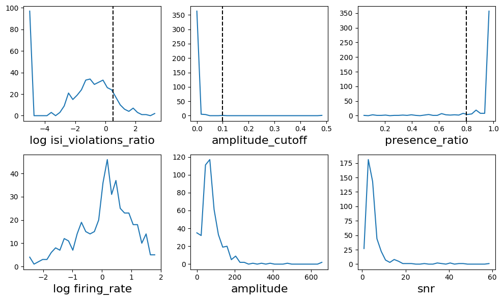

This tutorial will demonstrate the structure of the data file in an NWB (Neurodata Without Borders) file. In this particular example, we will be accessing information from an optotagging experiment, where the cells have light-gated ion channels that are activated by lasers. The data was taken using Neuropixels Opto (note that details about all the devices used, as well as the experimental apparatus, are included in the NWB file).

We begin with package imports which we'll need:


```python
import os
import glob
from hdmf_zarr import NWBZarrIO
from nwbwidgets import nwb2widget
import nwbinspector

from tqdm.auto import tqdm
import json
```

In order to do any analysis, of course, we'll also need the usual libraries:


```python
import numpy as np
import pandas as pd
import matplotlib.pyplot as plt
```

## Accessing an NWB file

To manipulate the data in the file, we will first need to find the file we're interested in and then load it into Python. We assume here that we have already received the datafile somehow and we know what directory we've stored the file in (for example, we could have mounted the Allen Brain Observatory to a virtual drive). We will find and load the file into Python using ```glob```, which will allow us to search the directory in which our data is located for particular strings. In this case, let's say we want to look for experiments involving a particular mouse.


```python
mouse_id = '625098'

nwb_file = glob.glob(os.path.join('/data', '*' + mouse_id + '*', '*', '*.nwb.zarr'))[0]

print(nwb_file)
```

    /data/ecephys_625098_2022-08-15_08-51-36_nwb_2023-05-16_16-28-23/ecephys_625098_2022-08-15_08-51-36_nwb/ecephys_625098_2022-08-15_08-51-36_experiment1_recording1.nwb.zarr
    

Above, the ```glob``` command tells Python to look for all the files found in /data/ that include the mouse ID we're interested in and generates a Python list with each file's path as its entries. In this case, the data we have mounted only has one file pertaining to mouse 625098, so the list has only one object in it with index [0]. However, if we had picked a different mouse ID, the list might have more than one entry, in which case we would need to select which file we wanted using a different index. 

So far, all we've done is find the path and store it as a string in Python. Now that we have the NWB file's path, we still need to load it into Python, which we can do using ```NWBZarrIO```.


```python
with NWBZarrIO(nwb_file, "r") as io:
    nwbfile_read = io.read()
```

This stores all the information contained in the NWB file into a ```NWBFile``` object from the ```pynwb``` package, and now we're ready to start working with the data. The first thing we might be interested in is just seeing the contents of the NWB file, which we can do by using the ```nwb2widget``` tool:


```python
nwb2widget(nwbfile_read)
```


    VBox(children=(HBox(children=(Label(value='session_description:', layout=Layout(max_height='40px', max_width='…


We can also access particular parts of the file. Of particular importance, for example, are the individual units (roughly corresponding to what we believe are individual neurons) in an experiment. The units table in particular is stored as a Pandas ```DataFrame``` object:


```python
units = nwbfile_read.units[:]
print(type(units))
```

    <class 'pandas.core.frame.DataFrame'>
    

Notice that the various types of data contained in the file are simply attributes of the ```nwbfile_read``` object, which we access in the usual way ```nwbfile_read.*```. Depending on the table of interest, they might be stored as different types of objects, however; for example, several are stored as objects specific to the ```pnwb``` package.

Focusing just on the units for the moment, we can examine what information is stored in the ```DataFrame```:


```python
print(units.columns.values)
```

    ['spike_times' 'electrodes' 'waveform_mean' 'waveform_sd' 'unit_name'
     'num_spikes' 'amplitude' 'isi_violations_ratio' 'default_qc' 'snr'
     'd_prime' 'ks_unit_id' 'sliding_rp_violation' 'amplitude_cutoff'
     'repolarization_slope' 'drift_std' 'isolation_distance' 'peak_to_valley'
     'device_name' 'l_ratio' 'peak_trough_ratio' 'recovery_slope'
     'presence_ratio' 'drift_ptp' 'drift_mad' 'half_width' 'rp_violations'
     'firing_rate' 'rp_contamination']
    

Or we can grab data from a specific unit:


```python
print(units.loc[418])
```

    spike_times             [250.0144502759746, 251.83286580602035, 253.17...
    electrodes              [0, 1, 2, 3, 4, 5, 6, 7, 8, 9, 10, 11, 12, 13,...
    waveform_mean           [[0.0, 0.0, 0.0, 0.0, 0.0, 0.0, 0.0, 0.0, 0.0,...
    waveform_sd             [[0.0, 0.0, 0.0, 0.0, 0.0, 0.0, 0.0, 0.0, 0.0,...
    unit_name                            13196032-2f2f-4c3a-b29c-bf26ffd886e7
    num_spikes                                                         5358.0
    amplitude                                                       95.465385
    isi_violations_ratio                                             0.444933
    default_qc                                                           True
    snr                                                              8.053837
    d_prime                                                          3.259165
    ks_unit_id                                                          431.0
    sliding_rp_violation                                                 0.29
    amplitude_cutoff                                                 0.000049
    repolarization_slope                                        950597.863219
    drift_std                                                        2.090388
    isolation_distance                                               95.19815
    peak_to_valley                                                    0.00024
    device_name                                                       Probe A
    l_ratio                                                          1.704699
    peak_trough_ratio                                                -0.45303
    recovery_slope                                               -74398.15011
    presence_ratio                                                        1.0
    drift_ptp                                                       14.337798
    drift_mad                                                        1.576851
    half_width                                                       0.000113
    rp_violations                                                        13.0
    firing_rate                                                      2.097357
    rp_contamination                                                      1.0
    Name: 418, dtype: object
    

We can access and plot unit quality metrics as follows:


```python
print(units['isi_violations_ratio'][418])
```

    0.4449333645997005
    


```python
%matplotlib inline

def plot_metric(metric, threshold=None, use_log=False):  
    m = units[metric].dropna()
    if use_log:
        m = np.log10(m+1e-5) # add small offset to avoid log(0)
    h,v = np.histogram(m, bins=30)
    plt.plot(v[:-1],h)
    if use_log:
        plt.xlabel("log "+metric, fontsize=16)
    else:
        plt.xlabel(metric, fontsize=16)
    if threshold:
        plt.axvline(x=threshold, ls='--', color='k')
        
qc_metrics = ['isi_violations_ratio','amplitude_cutoff','presence_ratio','firing_rate','amplitude','snr']
thresholds = [0.5, 0.1, 0.8, None, None, None]
use_log = [True, False, False, True, False, False]
plt.figure(figsize=(10,6))
for i, metric in enumerate(qc_metrics):
    plt.subplot(2,3,i+1)
    plot_metric(metric, thresholds[i], use_log[i])
    plt.tight_layout()

```


    

    


And check how many of the units pass default quality control metrics:


```python
units_passing_qc = units[units.default_qc=='True']
print(len(units_passing_qc))
```

    234
    

We can also take a look at other things besides the individual units involved. For example, the NWB also contains details on the subject for this experiment:


```python
print(nwbfile_read.subject)
```

    subject pynwb.file.Subject at 0x139977640021488
    Fields:
      age: P159D
      age__reference: birth
      date_of_birth: 2022-03-09 00:00:00-08:00
      genotype: Slc17a6-IRES-Cre/wt
      sex: F
      species: Mus musculus
      subject_id: 625098
    
    

As well as information on the trials done and what information we can look at in each trial:


```python
trials = nwbfile_read.trials[:]
print(trials.columns.values)
```

    ['start_time' 'stop_time' 'site' 'power' 'param_group' 'duration'
     'rise_time' 'num_pulses' 'wavelength' 'type' 'inter_pulse_interval'
     'stimulus_template_name']
    


```python
print(trials.stimulus_template_name.unique())
```

    ['internal_red-short_pulse-0.06mW' 'internal_red-train-0.01mW'
     'external_red-short_pulse-10.0mW' 'external_red-short_pulse-5.0mW'
     'internal_red-long_pulse-0.06mW' 'internal_red-train-0.06mW'
     'external_red-long_pulse-1.0mW' 'external_red-train-1.0mW'
     'internal_red-short_pulse-0.01mW' 'external_red-train-3.0mW'
     'internal_red-long_pulse-0.01mW' 'external_red-long_pulse-2.0mW'
     'external_red-short_pulse-4.0mW' 'external_red-train-4.0mW'
     'external_red-train-5.0mW' 'external_red-train-10.0mW'
     'external_red-short_pulse-3.0mW' 'external_red-long_pulse-3.0mW'
     'external_red-long_pulse-4.0mW' 'external_red-short_pulse-1.0mW'
     'external_red-train-2.0mW' 'external_red-long_pulse-10.0mW'
     'external_red-long_pulse-5.0mW' 'external_red-short_pulse-2.0mW']
    


```python
print(len(trials))
```

    5100
    


```python
print(trials.loc[1582])
```

    start_time                                   1211.763679
    stop_time                                    1212.593679
    site                                                   0
    power                                                4.0
    param_group                                  short_pulse
    duration                                            0.01
    rise_time                                          0.001
    num_pulses                                             1
    wavelength                                           638
    type                                        external_red
    inter_pulse_interval                                 0.0
    stimulus_template_name    external_red-short_pulse-4.0mW
    Name: 1582, dtype: object
    

When analyzing the data, it's also important to check for issues with the data. One way to look for this is by using the ```NWBInspector``` package to check the file for compliance with best practices. We can look grab any messages that ```NWBInspector``` has using the ```inspect_nwbfile_object``` command. ```NWBInspector``` will also highlight places where it might be possible to improve efficiency when grabbing data (for example, if our time steps are constant, it might be better to simply specify a time range and a sampling rate).


```python
from nwbinspector import inspect_nwbfile_object

messages = list(inspect_nwbfile_object(nwbfile_read))
```


```python
print(len(messages))
```

    81
    

This has given us 81 messages, but they're not all necessarily critical messages. Let's take a look at the information in a particular message:


```python
print(messages[0])
```

    InspectorMessage(
        message="Description ('No description.') is a placeholder.",
        importance=<Importance.BEST_PRACTICE_SUGGESTION: 0>,
        severity=<Severity.LOW: 1>,
        check_function_name='check_description',
        object_type='VectorData',
        object_name='rp_contamination',
        location=None,
        file_path=None
    )
    

As we can see, this isn't very readable and also doesn't seem like a particularly important issue. We can sort the message importance and improve readability using a built-in tool in ```nwbinspector```, ```format_messages```:


```python
from nwbinspector.inspector_tools import format_messages

print("\n".join(format_messages(messages, levels=["importance"])))
```

    **************************************************
    NWBInspector Report Summary
    
    Timestamp: 2024-06-20 20:02:00.723820+00:00
    Platform: Linux-4.14.345-262.561.amzn2.x86_64-x86_64-with-glibc2.10
    NWBInspector version: 0.4.28
    
    Found 81 issues over 1 files:
          25 - BEST_PRACTICE_VIOLATION
          56 - BEST_PRACTICE_SUGGESTION
    **************************************************
    
    
    .0  Importance.BEST_PRACTICE_VIOLATION: None - check_time_interval_time_columns - 'TimeIntervals' object with name 'trials'
          Message: ['rise_time'] are time columns but the values are not in ascending order. All times should be in seconds with respect to the session start time.
    
    .1  Importance.BEST_PRACTICE_VIOLATION: None - check_regular_timestamps - 'TimeSeries' object with name 'internal_red-train-0.06mW'
          Message: TimeSeries appears to have a constant sampling rate. Consider specifying starting_time=-0.01 and rate=3.333333333333313e-05 instead of timestamps.
    
    .2  Importance.BEST_PRACTICE_VIOLATION: None - check_regular_timestamps - 'TimeSeries' object with name 'internal_red-train-0.01mW'
          Message: TimeSeries appears to have a constant sampling rate. Consider specifying starting_time=-0.01 and rate=3.333333333333313e-05 instead of timestamps.
    
    .3  Importance.BEST_PRACTICE_VIOLATION: None - check_regular_timestamps - 'TimeSeries' object with name 'internal_red-short_pulse-0.06mW'
          Message: TimeSeries appears to have a constant sampling rate. Consider specifying starting_time=-0.01 and rate=3.333333333333313e-05 instead of timestamps.
    
    .4  Importance.BEST_PRACTICE_VIOLATION: None - check_regular_timestamps - 'TimeSeries' object with name 'internal_red-short_pulse-0.01mW'
          Message: TimeSeries appears to have a constant sampling rate. Consider specifying starting_time=-0.01 and rate=3.333333333333313e-05 instead of timestamps.
    
    .5  Importance.BEST_PRACTICE_VIOLATION: None - check_regular_timestamps - 'TimeSeries' object with name 'internal_red-long_pulse-0.06mW'
          Message: TimeSeries appears to have a constant sampling rate. Consider specifying starting_time=-0.01 and rate=3.333333333333313e-05 instead of timestamps.
    
    .6  Importance.BEST_PRACTICE_VIOLATION: None - check_regular_timestamps - 'TimeSeries' object with name 'internal_red-long_pulse-0.01mW'
          Message: TimeSeries appears to have a constant sampling rate. Consider specifying starting_time=-0.01 and rate=3.333333333333313e-05 instead of timestamps.
    
    .7  Importance.BEST_PRACTICE_VIOLATION: None - check_regular_timestamps - 'TimeSeries' object with name 'external_red-train-5.0mW'
          Message: TimeSeries appears to have a constant sampling rate. Consider specifying starting_time=-0.01 and rate=3.333333333333313e-05 instead of timestamps.
    
    .8  Importance.BEST_PRACTICE_VIOLATION: None - check_regular_timestamps - 'TimeSeries' object with name 'external_red-train-4.0mW'
          Message: TimeSeries appears to have a constant sampling rate. Consider specifying starting_time=-0.01 and rate=3.333333333333313e-05 instead of timestamps.
    
    .9  Importance.BEST_PRACTICE_VIOLATION: None - check_regular_timestamps - 'TimeSeries' object with name 'external_red-train-3.0mW'
          Message: TimeSeries appears to have a constant sampling rate. Consider specifying starting_time=-0.01 and rate=3.333333333333313e-05 instead of timestamps.
    
    .10  Importance.BEST_PRACTICE_VIOLATION: None - check_regular_timestamps - 'TimeSeries' object with name 'external_red-train-2.0mW'
           Message: TimeSeries appears to have a constant sampling rate. Consider specifying starting_time=-0.01 and rate=3.333333333333313e-05 instead of timestamps.
    
    .11  Importance.BEST_PRACTICE_VIOLATION: None - check_regular_timestamps - 'TimeSeries' object with name 'external_red-train-10.0mW'
           Message: TimeSeries appears to have a constant sampling rate. Consider specifying starting_time=-0.01 and rate=3.333333333333313e-05 instead of timestamps.
    
    .12  Importance.BEST_PRACTICE_VIOLATION: None - check_regular_timestamps - 'TimeSeries' object with name 'external_red-train-1.0mW'
           Message: TimeSeries appears to have a constant sampling rate. Consider specifying starting_time=-0.01 and rate=3.333333333333313e-05 instead of timestamps.
    
    .13  Importance.BEST_PRACTICE_VIOLATION: None - check_regular_timestamps - 'TimeSeries' object with name 'external_red-short_pulse-5.0mW'
           Message: TimeSeries appears to have a constant sampling rate. Consider specifying starting_time=-0.01 and rate=3.333333333333313e-05 instead of timestamps.
    
    .14  Importance.BEST_PRACTICE_VIOLATION: None - check_regular_timestamps - 'TimeSeries' object with name 'external_red-short_pulse-4.0mW'
           Message: TimeSeries appears to have a constant sampling rate. Consider specifying starting_time=-0.01 and rate=3.333333333333313e-05 instead of timestamps.
    
    .15  Importance.BEST_PRACTICE_VIOLATION: None - check_regular_timestamps - 'TimeSeries' object with name 'external_red-short_pulse-3.0mW'
           Message: TimeSeries appears to have a constant sampling rate. Consider specifying starting_time=-0.01 and rate=3.333333333333313e-05 instead of timestamps.
    
    .16  Importance.BEST_PRACTICE_VIOLATION: None - check_regular_timestamps - 'TimeSeries' object with name 'external_red-short_pulse-2.0mW'
           Message: TimeSeries appears to have a constant sampling rate. Consider specifying starting_time=-0.01 and rate=3.333333333333313e-05 instead of timestamps.
    
    .17  Importance.BEST_PRACTICE_VIOLATION: None - check_regular_timestamps - 'TimeSeries' object with name 'external_red-short_pulse-10.0mW'
           Message: TimeSeries appears to have a constant sampling rate. Consider specifying starting_time=-0.01 and rate=3.333333333333313e-05 instead of timestamps.
    
    .18  Importance.BEST_PRACTICE_VIOLATION: None - check_regular_timestamps - 'TimeSeries' object with name 'external_red-short_pulse-1.0mW'
           Message: TimeSeries appears to have a constant sampling rate. Consider specifying starting_time=-0.01 and rate=3.333333333333313e-05 instead of timestamps.
    
    .19  Importance.BEST_PRACTICE_VIOLATION: None - check_regular_timestamps - 'TimeSeries' object with name 'external_red-long_pulse-5.0mW'
           Message: TimeSeries appears to have a constant sampling rate. Consider specifying starting_time=-0.01 and rate=3.333333333333313e-05 instead of timestamps.
    
    .20  Importance.BEST_PRACTICE_VIOLATION: None - check_regular_timestamps - 'TimeSeries' object with name 'external_red-long_pulse-4.0mW'
           Message: TimeSeries appears to have a constant sampling rate. Consider specifying starting_time=-0.01 and rate=3.333333333333313e-05 instead of timestamps.
    
    .21  Importance.BEST_PRACTICE_VIOLATION: None - check_regular_timestamps - 'TimeSeries' object with name 'external_red-long_pulse-3.0mW'
           Message: TimeSeries appears to have a constant sampling rate. Consider specifying starting_time=-0.01 and rate=3.333333333333313e-05 instead of timestamps.
    
    .22  Importance.BEST_PRACTICE_VIOLATION: None - check_regular_timestamps - 'TimeSeries' object with name 'external_red-long_pulse-2.0mW'
           Message: TimeSeries appears to have a constant sampling rate. Consider specifying starting_time=-0.01 and rate=3.333333333333313e-05 instead of timestamps.
    
    .23  Importance.BEST_PRACTICE_VIOLATION: None - check_regular_timestamps - 'TimeSeries' object with name 'external_red-long_pulse-10.0mW'
           Message: TimeSeries appears to have a constant sampling rate. Consider specifying starting_time=-0.01 and rate=3.333333333333313e-05 instead of timestamps.
    
    .24  Importance.BEST_PRACTICE_VIOLATION: None - check_regular_timestamps - 'TimeSeries' object with name 'external_red-long_pulse-1.0mW'
           Message: TimeSeries appears to have a constant sampling rate. Consider specifying starting_time=-0.01 and rate=3.333333333333313e-05 instead of timestamps.
    
    .25  Importance.BEST_PRACTICE_SUGGESTION: None - check_description - 'VectorData' object with name 'rp_contamination'
           Message: Description ('No description.') is a placeholder.
    
    .26  Importance.BEST_PRACTICE_SUGGESTION: None - check_description - 'VectorData' object with name 'rp_violations'
           Message: Description ('No description.') is a placeholder.
    
    .27  Importance.BEST_PRACTICE_SUGGESTION: None - check_description - 'VectorData' object with name 'half_width'
           Message: Description ('No description.') is a placeholder.
    
    .28  Importance.BEST_PRACTICE_SUGGESTION: None - check_description - 'VectorData' object with name 'drift_mad'
           Message: Description ('No description.') is a placeholder.
    
    .29  Importance.BEST_PRACTICE_SUGGESTION: None - check_description - 'VectorData' object with name 'drift_ptp'
           Message: Description ('No description.') is a placeholder.
    
    .30  Importance.BEST_PRACTICE_SUGGESTION: None - check_description - 'VectorData' object with name 'presence_ratio'
           Message: Description ('No description.') is a placeholder.
    
    .31  Importance.BEST_PRACTICE_SUGGESTION: None - check_description - 'VectorData' object with name 'recovery_slope'
           Message: Description ('No description.') is a placeholder.
    
    .32  Importance.BEST_PRACTICE_SUGGESTION: None - check_description - 'VectorData' object with name 'peak_trough_ratio'
           Message: Description ('No description.') is a placeholder.
    
    .33  Importance.BEST_PRACTICE_SUGGESTION: None - check_description - 'VectorData' object with name 'l_ratio'
           Message: Description ('No description.') is a placeholder.
    
    .34  Importance.BEST_PRACTICE_SUGGESTION: None - check_description - 'VectorData' object with name 'device_name'
           Message: Description ('No description.') is a placeholder.
    
    .35  Importance.BEST_PRACTICE_SUGGESTION: None - check_description - 'VectorData' object with name 'isolation_distance'
           Message: Description ('No description.') is a placeholder.
    
    .36  Importance.BEST_PRACTICE_SUGGESTION: None - check_description - 'VectorData' object with name 'drift_std'
           Message: Description ('No description.') is a placeholder.
    
    .37  Importance.BEST_PRACTICE_SUGGESTION: None - check_description - 'VectorData' object with name 'repolarization_slope'
           Message: Description ('No description.') is a placeholder.
    
    .38  Importance.BEST_PRACTICE_SUGGESTION: None - check_description - 'VectorData' object with name 'amplitude_cutoff'
           Message: Description ('No description.') is a placeholder.
    
    .39  Importance.BEST_PRACTICE_SUGGESTION: None - check_description - 'VectorData' object with name 'sliding_rp_violation'
           Message: Description ('No description.') is a placeholder.
    
    .40  Importance.BEST_PRACTICE_SUGGESTION: None - check_description - 'VectorData' object with name 'ks_unit_id'
           Message: Description ('No description.') is a placeholder.
    
    .41  Importance.BEST_PRACTICE_SUGGESTION: None - check_description - 'VectorData' object with name 'd_prime'
           Message: Description ('No description.') is a placeholder.
    
    .42  Importance.BEST_PRACTICE_SUGGESTION: None - check_description - 'VectorData' object with name 'default_qc'
           Message: Description ('No description.') is a placeholder.
    
    .43  Importance.BEST_PRACTICE_SUGGESTION: None - check_description - 'VectorData' object with name 'isi_violations_ratio'
           Message: Description ('No description.') is a placeholder.
    
    .44  Importance.BEST_PRACTICE_SUGGESTION: None - check_description - 'VectorData' object with name 'amplitude'
           Message: Description ('No description.') is a placeholder.
    
    .45  Importance.BEST_PRACTICE_SUGGESTION: None - check_description - 'VectorData' object with name 'num_spikes'
           Message: Description ('No description.') is a placeholder.
    
    .46  Importance.BEST_PRACTICE_SUGGESTION: None - check_description - 'Subject' object at location '/general/subject'
           Message: Description is missing.
    
    .47  Importance.BEST_PRACTICE_SUGGESTION: None - check_description - 'VectorData' object with name 'inter_pulse_interval'
           Message: Description is missing.
    
    .48  Importance.BEST_PRACTICE_SUGGESTION: None - check_description - 'VectorData' object with name 'quality'
           Message: Description ('no description') is a placeholder.
    
    .49  Importance.BEST_PRACTICE_SUGGESTION: None - check_description - 'VectorData' object with name 'offset_to_uV'
           Message: Description ('no description') is a placeholder.
    
    .50  Importance.BEST_PRACTICE_SUGGESTION: None - check_description - 'VectorData' object with name 'gain_to_uV'
           Message: Description ('no description') is a placeholder.
    
    .51  Importance.BEST_PRACTICE_SUGGESTION: None - check_description - 'VectorData' object with name 'inter_sample_shift'
           Message: Description ('no description') is a placeholder.
    
    .52  Importance.BEST_PRACTICE_SUGGESTION: None - check_description - 'VectorData' object with name 'channel_name'
           Message: Description ('no description') is a placeholder.
    
    .53  Importance.BEST_PRACTICE_SUGGESTION: None - check_empty_string_for_optional_attribute - 'NWBFile' object at location '/'
           Message: The attribute "experiment_description" is optional and you have supplied an empty string. Improve my omitting this attribute (in MatNWB or PyNWB) or entering as None (in PyNWB)
    
    .54  Importance.BEST_PRACTICE_SUGGESTION: None - check_experimenter_form - 'NWBFile' object at location '/'
           Message: The name of experimenter 'Anna Lakunina' does not match any of the accepted DANDI forms: 'LastName, Firstname', 'LastName, FirstName MiddleInitial.' or 'LastName, FirstName, MiddleName'.
    
    .55  Importance.BEST_PRACTICE_SUGGESTION: None - check_experiment_description - 'NWBFile' object at location '/'
           Message: Experiment description is missing.
    
    .56  Importance.BEST_PRACTICE_SUGGESTION: None - check_keywords - 'NWBFile' object at location '/'
           Message: Metadata /general/keywords is missing.
    
    .57  Importance.BEST_PRACTICE_SUGGESTION: None - check_timestamp_of_the_first_sample_is_not_negative - 'TimeSeries' object with name 'internal_red-train-0.06mW'
           Message: Timestamps should not be negative. It is recommended to align the `session_start_time` or `timestamps_reference_time` to be the earliest time value that occurs in the data, and shift all other signals accordingly.
    
    .58  Importance.BEST_PRACTICE_SUGGESTION: None - check_timestamp_of_the_first_sample_is_not_negative - 'TimeSeries' object with name 'internal_red-train-0.01mW'
           Message: Timestamps should not be negative. It is recommended to align the `session_start_time` or `timestamps_reference_time` to be the earliest time value that occurs in the data, and shift all other signals accordingly.
    
    .59  Importance.BEST_PRACTICE_SUGGESTION: None - check_timestamp_of_the_first_sample_is_not_negative - 'TimeSeries' object with name 'internal_red-short_pulse-0.06mW'
           Message: Timestamps should not be negative. It is recommended to align the `session_start_time` or `timestamps_reference_time` to be the earliest time value that occurs in the data, and shift all other signals accordingly.
    
    .60  Importance.BEST_PRACTICE_SUGGESTION: None - check_timestamp_of_the_first_sample_is_not_negative - 'TimeSeries' object with name 'internal_red-short_pulse-0.01mW'
           Message: Timestamps should not be negative. It is recommended to align the `session_start_time` or `timestamps_reference_time` to be the earliest time value that occurs in the data, and shift all other signals accordingly.
    
    .61  Importance.BEST_PRACTICE_SUGGESTION: None - check_timestamp_of_the_first_sample_is_not_negative - 'TimeSeries' object with name 'internal_red-long_pulse-0.06mW'
           Message: Timestamps should not be negative. It is recommended to align the `session_start_time` or `timestamps_reference_time` to be the earliest time value that occurs in the data, and shift all other signals accordingly.
    
    .62  Importance.BEST_PRACTICE_SUGGESTION: None - check_timestamp_of_the_first_sample_is_not_negative - 'TimeSeries' object with name 'internal_red-long_pulse-0.01mW'
           Message: Timestamps should not be negative. It is recommended to align the `session_start_time` or `timestamps_reference_time` to be the earliest time value that occurs in the data, and shift all other signals accordingly.
    
    .63  Importance.BEST_PRACTICE_SUGGESTION: None - check_timestamp_of_the_first_sample_is_not_negative - 'TimeSeries' object with name 'external_red-train-5.0mW'
           Message: Timestamps should not be negative. It is recommended to align the `session_start_time` or `timestamps_reference_time` to be the earliest time value that occurs in the data, and shift all other signals accordingly.
    
    .64  Importance.BEST_PRACTICE_SUGGESTION: None - check_timestamp_of_the_first_sample_is_not_negative - 'TimeSeries' object with name 'external_red-train-4.0mW'
           Message: Timestamps should not be negative. It is recommended to align the `session_start_time` or `timestamps_reference_time` to be the earliest time value that occurs in the data, and shift all other signals accordingly.
    
    .65  Importance.BEST_PRACTICE_SUGGESTION: None - check_timestamp_of_the_first_sample_is_not_negative - 'TimeSeries' object with name 'external_red-train-3.0mW'
           Message: Timestamps should not be negative. It is recommended to align the `session_start_time` or `timestamps_reference_time` to be the earliest time value that occurs in the data, and shift all other signals accordingly.
    
    .66  Importance.BEST_PRACTICE_SUGGESTION: None - check_timestamp_of_the_first_sample_is_not_negative - 'TimeSeries' object with name 'external_red-train-2.0mW'
           Message: Timestamps should not be negative. It is recommended to align the `session_start_time` or `timestamps_reference_time` to be the earliest time value that occurs in the data, and shift all other signals accordingly.
    
    .67  Importance.BEST_PRACTICE_SUGGESTION: None - check_timestamp_of_the_first_sample_is_not_negative - 'TimeSeries' object with name 'external_red-train-10.0mW'
           Message: Timestamps should not be negative. It is recommended to align the `session_start_time` or `timestamps_reference_time` to be the earliest time value that occurs in the data, and shift all other signals accordingly.
    
    .68  Importance.BEST_PRACTICE_SUGGESTION: None - check_timestamp_of_the_first_sample_is_not_negative - 'TimeSeries' object with name 'external_red-train-1.0mW'
           Message: Timestamps should not be negative. It is recommended to align the `session_start_time` or `timestamps_reference_time` to be the earliest time value that occurs in the data, and shift all other signals accordingly.
    
    .69  Importance.BEST_PRACTICE_SUGGESTION: None - check_timestamp_of_the_first_sample_is_not_negative - 'TimeSeries' object with name 'external_red-short_pulse-5.0mW'
           Message: Timestamps should not be negative. It is recommended to align the `session_start_time` or `timestamps_reference_time` to be the earliest time value that occurs in the data, and shift all other signals accordingly.
    
    .70  Importance.BEST_PRACTICE_SUGGESTION: None - check_timestamp_of_the_first_sample_is_not_negative - 'TimeSeries' object with name 'external_red-short_pulse-4.0mW'
           Message: Timestamps should not be negative. It is recommended to align the `session_start_time` or `timestamps_reference_time` to be the earliest time value that occurs in the data, and shift all other signals accordingly.
    
    .71  Importance.BEST_PRACTICE_SUGGESTION: None - check_timestamp_of_the_first_sample_is_not_negative - 'TimeSeries' object with name 'external_red-short_pulse-3.0mW'
           Message: Timestamps should not be negative. It is recommended to align the `session_start_time` or `timestamps_reference_time` to be the earliest time value that occurs in the data, and shift all other signals accordingly.
    
    .72  Importance.BEST_PRACTICE_SUGGESTION: None - check_timestamp_of_the_first_sample_is_not_negative - 'TimeSeries' object with name 'external_red-short_pulse-2.0mW'
           Message: Timestamps should not be negative. It is recommended to align the `session_start_time` or `timestamps_reference_time` to be the earliest time value that occurs in the data, and shift all other signals accordingly.
    
    .73  Importance.BEST_PRACTICE_SUGGESTION: None - check_timestamp_of_the_first_sample_is_not_negative - 'TimeSeries' object with name 'external_red-short_pulse-10.0mW'
           Message: Timestamps should not be negative. It is recommended to align the `session_start_time` or `timestamps_reference_time` to be the earliest time value that occurs in the data, and shift all other signals accordingly.
    
    .74  Importance.BEST_PRACTICE_SUGGESTION: None - check_timestamp_of_the_first_sample_is_not_negative - 'TimeSeries' object with name 'external_red-short_pulse-1.0mW'
           Message: Timestamps should not be negative. It is recommended to align the `session_start_time` or `timestamps_reference_time` to be the earliest time value that occurs in the data, and shift all other signals accordingly.
    
    .75  Importance.BEST_PRACTICE_SUGGESTION: None - check_timestamp_of_the_first_sample_is_not_negative - 'TimeSeries' object with name 'external_red-long_pulse-5.0mW'
           Message: Timestamps should not be negative. It is recommended to align the `session_start_time` or `timestamps_reference_time` to be the earliest time value that occurs in the data, and shift all other signals accordingly.
    
    .76  Importance.BEST_PRACTICE_SUGGESTION: None - check_timestamp_of_the_first_sample_is_not_negative - 'TimeSeries' object with name 'external_red-long_pulse-4.0mW'
           Message: Timestamps should not be negative. It is recommended to align the `session_start_time` or `timestamps_reference_time` to be the earliest time value that occurs in the data, and shift all other signals accordingly.
    
    .77  Importance.BEST_PRACTICE_SUGGESTION: None - check_timestamp_of_the_first_sample_is_not_negative - 'TimeSeries' object with name 'external_red-long_pulse-3.0mW'
           Message: Timestamps should not be negative. It is recommended to align the `session_start_time` or `timestamps_reference_time` to be the earliest time value that occurs in the data, and shift all other signals accordingly.
    
    .78  Importance.BEST_PRACTICE_SUGGESTION: None - check_timestamp_of_the_first_sample_is_not_negative - 'TimeSeries' object with name 'external_red-long_pulse-2.0mW'
           Message: Timestamps should not be negative. It is recommended to align the `session_start_time` or `timestamps_reference_time` to be the earliest time value that occurs in the data, and shift all other signals accordingly.
    
    .79  Importance.BEST_PRACTICE_SUGGESTION: None - check_timestamp_of_the_first_sample_is_not_negative - 'TimeSeries' object with name 'external_red-long_pulse-10.0mW'
           Message: Timestamps should not be negative. It is recommended to align the `session_start_time` or `timestamps_reference_time` to be the earliest time value that occurs in the data, and shift all other signals accordingly.
    
    .80  Importance.BEST_PRACTICE_SUGGESTION: None - check_timestamp_of_the_first_sample_is_not_negative - 'TimeSeries' object with name 'external_red-long_pulse-1.0mW'
           Message: Timestamps should not be negative. It is recommended to align the `session_start_time` or `timestamps_reference_time` to be the earliest time value that occurs in the data, and shift all other signals accordingly.
    
    


```python

```
